<h1 align="center">
    <a href="#" alt="App ResolveAí"> Aplicativo OFairTa </a>
</h1>

<h3 align="center">
    O OFairTa tem por objetivo proporcionar facilidade  na compra e venda de produtos oriundos dos pequenos produtores rurais da microrregião do Vão do Paranã.
</h3>

<h4 align="center">
	🚧   Em andamento 🚀 🚧
</h4>

## 💻 Sobre o projeto

O aplicativo será disponibilizado na loja virtual de aplicativos Google Play app store de forma gratuita e será alimentado com dados de pequenos produtores da região alvo através de um banco de dados gerado pelo cadastro de produtores e produtos ofertados no próprio aplicativo.

---

## ⚙️ Funcionalidades Prontas

- [x] Cadastro de Usuário
- [x] Alteração de dadis do Usuário
- [x] Aunteticação de usuarios com e-mail e senha
- [x] Carrinho
- [x] Listagem de produtos por banca

## ⚙️ Telas prontas - Estáticas

- [x] Carrinho
- [x] Configurações ressalvas
- [] Notificações
- [] Busca

## ⚙️ Bugs a serem resolvidos

- [x] Imagens dos produtos
- [x] menu tab

  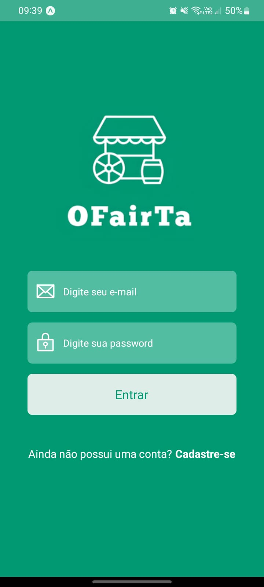
  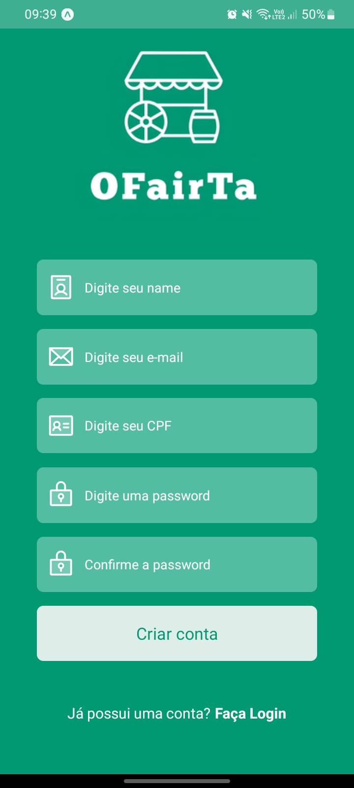
  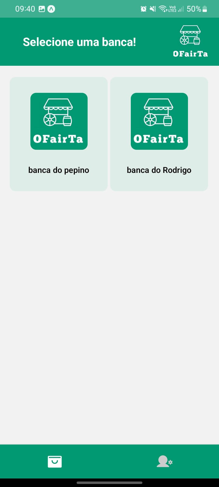
  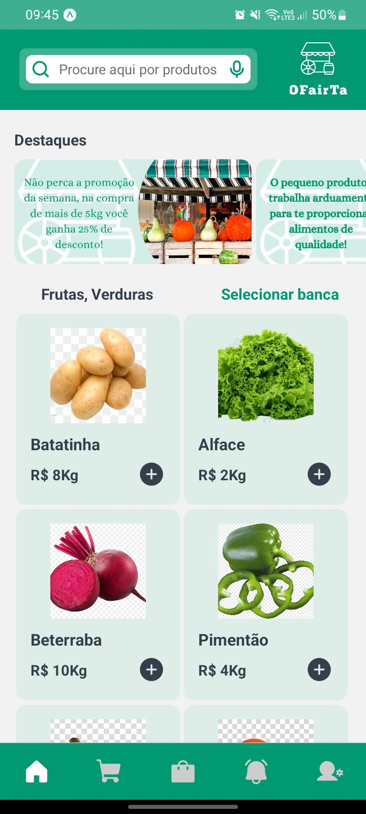
  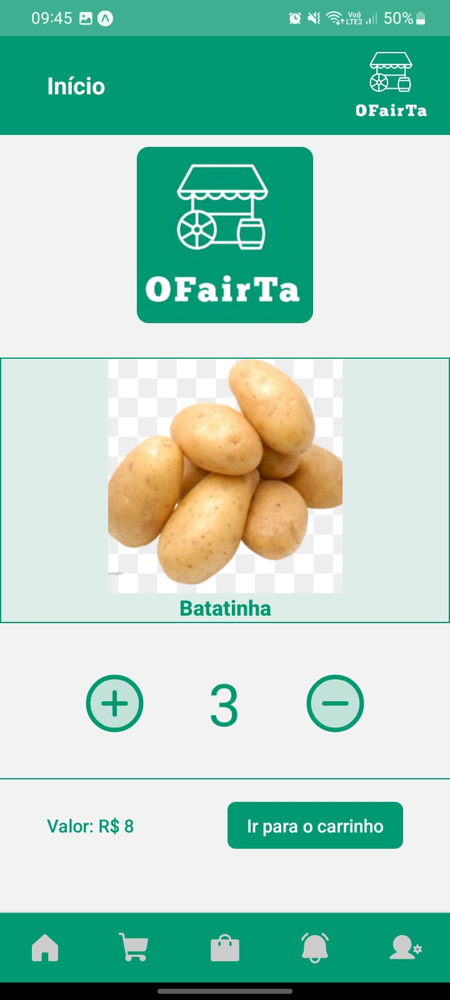
  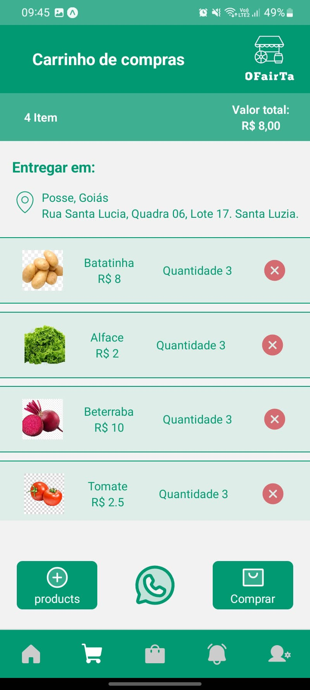
  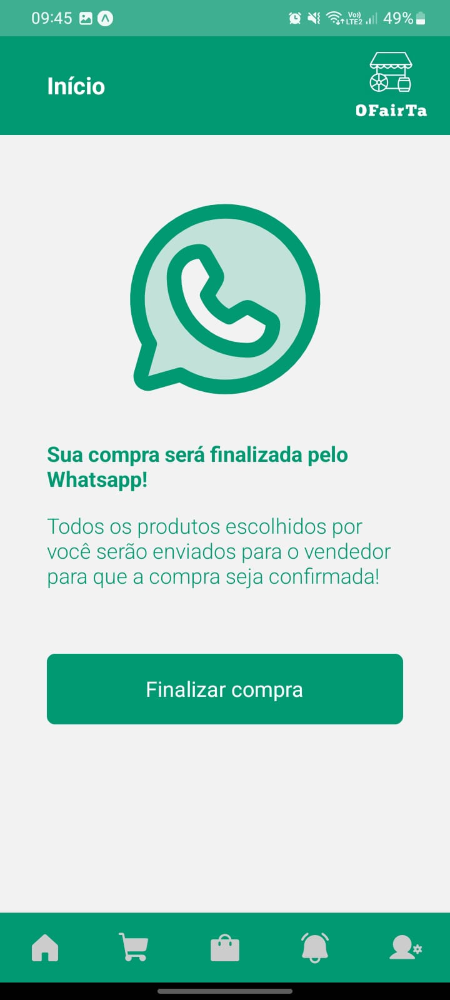
  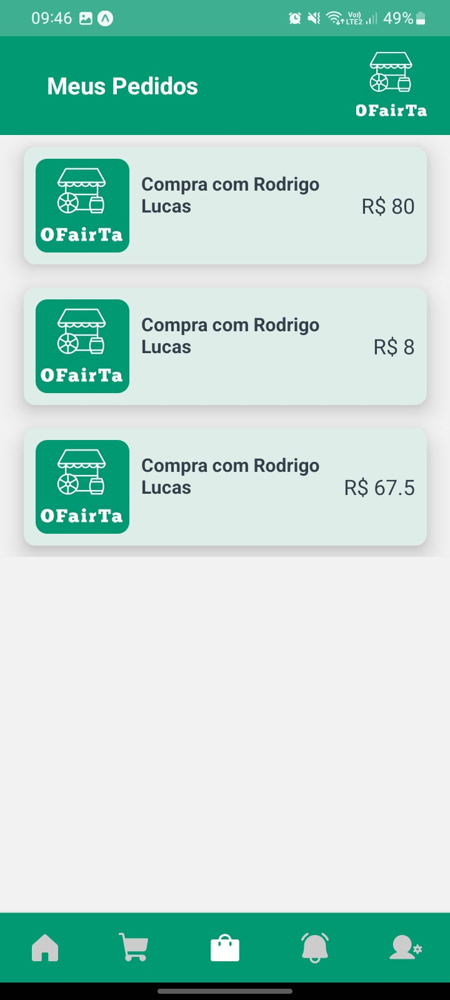
  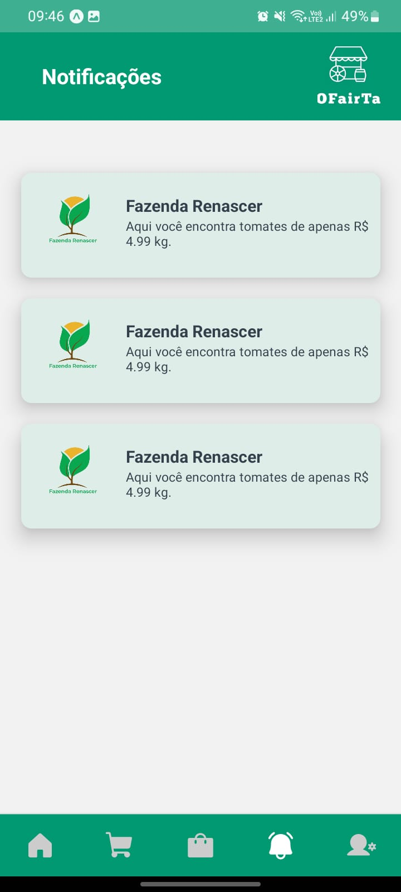
  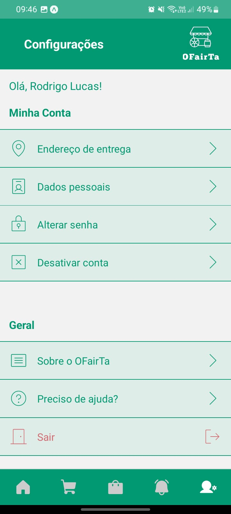
  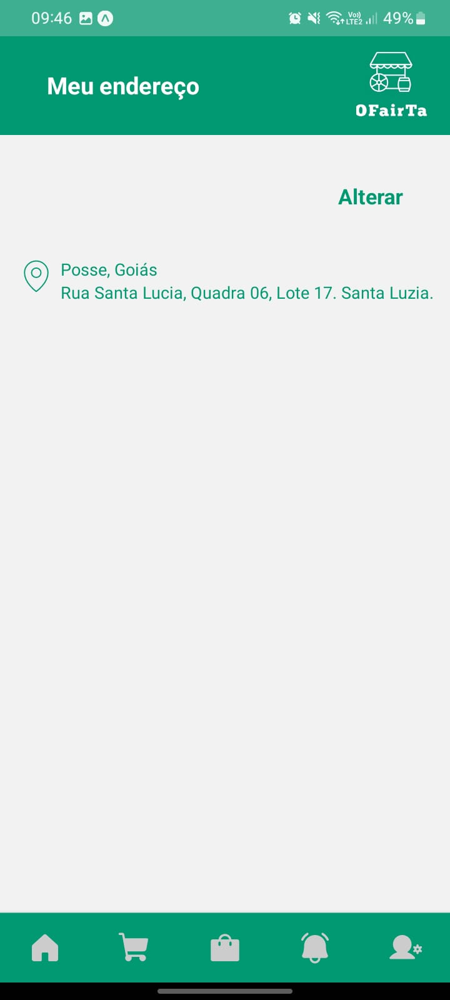
  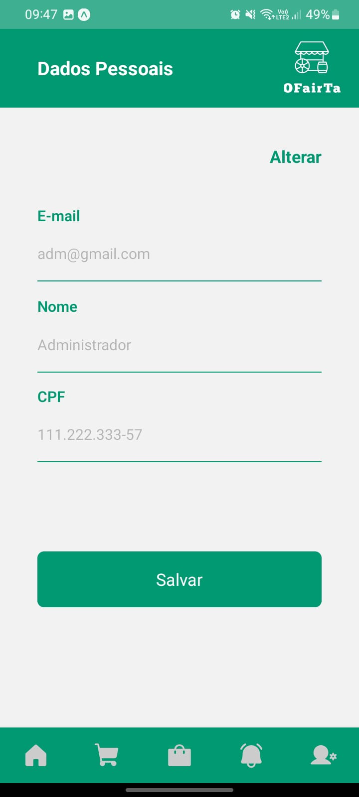
  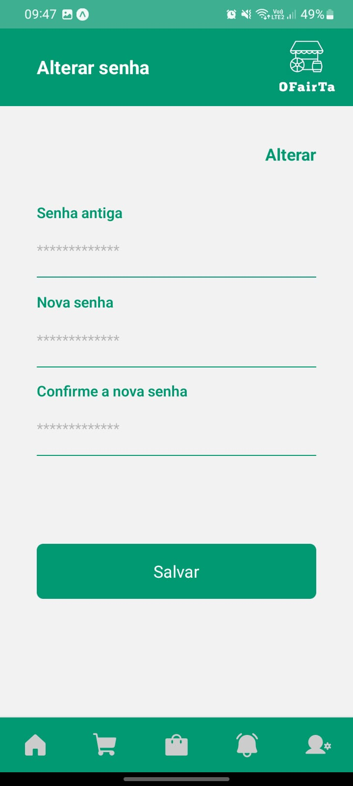
  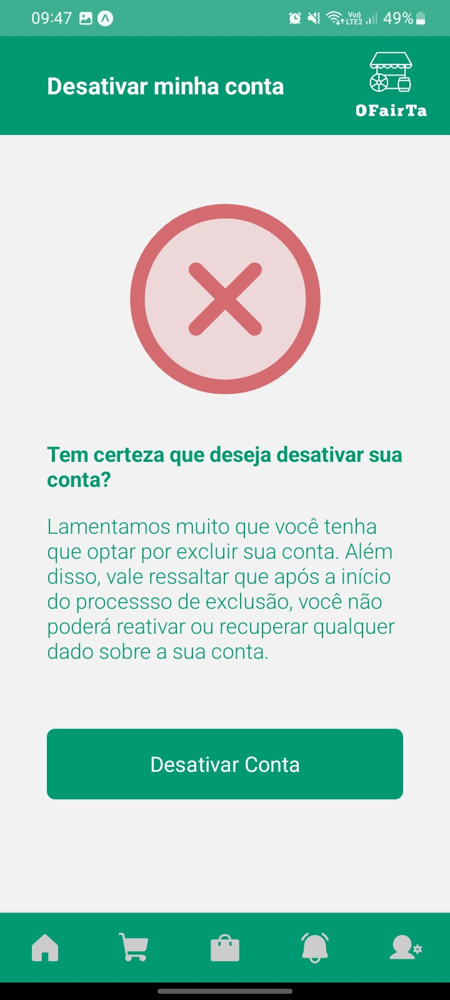

## 🛠 Tecnologias

As seguintes ferramentas foram usadas na construção do projeto:

#### **Backend** ([NodeJS](https://nodejs.org/en/))

- **[Express](https://expressjs.com/)**
- **[Prisma](https://www.prisma.io)**
- **[Typescript](https://www.typescriptlang.org/)**
- **[Bcryptjs](https://www.npmjs.com/package/bcryptjs)**
- **[Multer](https://www.npmjs.com/package/multer)**

#### **Frontend Mobile** ([NodeJS](https://nodejs.org/en/))

- **[React](https://pt-br.reactjs.org/)**
- **[Expo](https://expo.dev/)**
- **[React Native](https://reactnative.dev/)**
- **[Axios](https://axios-http.com/ptbr/docs/intro)**
- **[Phosphor Icons](https://phosphoricons.com/)**
- **[React Native Async Store](https://reactnative.dev/docs/asyncstorage)**
- **[JWT Decode](https://www.npmjs.com/package/jwt-decode)**

## 📝 Licença

Este projeto esta sobe a licença [MIT](./LICENSE).
